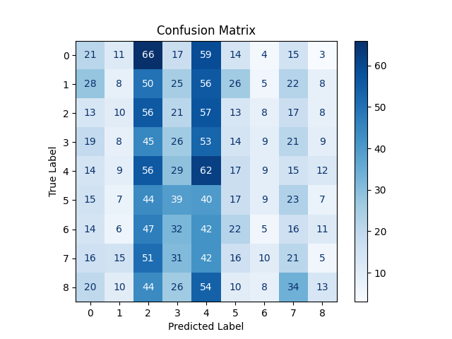
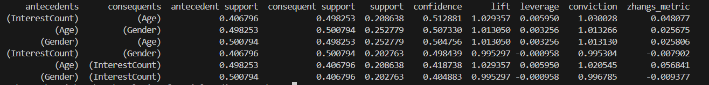

# analysis-of-social-media-user-data

# Introduction

An analysis of social media user data has been carried out on a
based on the database
[link](https://www.kaggle.com/datasets/arindamsahoo/social-media-users/data). In
order to analyze, data preprocessing was first performed, classification
with simple classifiers, classification with neural networks. And
association rules were searched for.

# Preprocessing

## Column meanings, problems in the database.

The main preprocessing tasks placed in the *main.py* file.

The *SocialMediaUsersDataset.csv* database contains the following columns:
UserID, Name, Gender, DOB, Interests, City, Country.

For further analysis, the UserId and Name columns removed because they do not
contribute any information. And it was saved to a file
*DataWithNoNameNoId.csv*.

Then the DOB column, storing the users' dates of birth
was converted to the Age column, where the age is.

So the Gender column, which stores gender data in the form of the words.
\“Male” and “Female” was mapped to 0 and 1 as follows:

```.
gender_mapping = { “Male”: 0, 'Female': 1}
df['Gender'] = df['Gender'].map(gender_mapping)
```

One of the biggest problems in this database is the countries and cities.
Because the number of occurrences of each country varies quite a bit. For example
the most frequent occurrence of 'United States' is 12311 times, and the least is 'Saint.
Lucia', 'American Samoa', 'Saint Martin' appear one time. Z
cities it is more difficult, because they are linked to countries. Therefore,
the following approach was adopted: remove the 'City' column.And for countries
10 of the most frequently occurring ones were selected.

The second big problem in the database was the 'Interests' column, representing the
people's interests. The problem with this column is that it can
contain as both one interest and several of them.
Also, there was a problem that the 'Fashion' interest was nearly 18
000 times, and the rest about 9,000.So for the final base 9 were selected
most frequent except for 'Fashion'.

Due to the small number of columns in the database, a column was still added
InterestCount, representing the number of interests of a given person.

The final database contains only numeric columns in it, which facilitates
data processing. The columns are: \`Gender, Interests, Country,
InterestCount, Age.” Each interest and country have been mapped
into numbers. While there are an equal number of
records for each country, this was done to balance the database.
database. This combination of the database results in a total of 6,300 records in the
*data.csv* database.

```
selected_countries = ['United States', 'India', 'China', 'Brazil', 'Russia', 'Germany', 'Japan', 'United Kingdom', 'France', 'Mexico']
selected_interests = ["'Cooking'", "'Pets'" ,"'Movies'" ,"'Gaming'", "'Fitness'" ,"'Outdoor activities'", "'Travel'", "'Business and entrepreneurship'" , "'Social causes and activism'"]

country_to_index = {country: index for index, country in enumerate(selected_countries)}
interest_to_index = {interest: index for index, interest in enumerate(selected_interests)}

df['Country'] = df['Country'].apply(lambda x: country_to_index[x] if x in selected_countries else None)
df = df.dropna(subset=['Country']).astype({'Country': 'int'})
df = df[df['Interests'].isin(selected_interests)]
df['Interests'] = df['Interests'].apply(lambda x: interest_to_index[x] if x in selected_interests else None)
df = df.dropna(subset=['Interests']).astype({'Interests': 'int'})

final_df = pd.DataFrame(columns=df.columns)
grouped = df.groupby(['Country', 'Interests'])
for (country, interest), data in grouped:
    if len(data) < 70:
        final_df = pd.concat([final_df, data], ignore_index=True)
    else:
        sampled_data = data.sample(n=70, random_state=42)
        final_df = pd.concat([final_df, sampled_data], ignore_index=True)

final_df = final_df.groupby(['Country', 'Interests']).head(70).reset_index(drop=True)

final_df.to_csv('data.csv', index=False)
```

Also, as preprocessing, scaled data in the columns of the
InterestCount and Age, file *scaled.py*. The scaled database is
saved to *datascaled.csv* file.

# Classification with simple classifiers

## Classification of interests

Classification with simple classifiers was performed:

1. Nearest Neighbor (3, 5, 11, 100)

2. naive Bayes

3. desicion Tree

4. Random Forest

Using the above-mentioned classifiers, I first classified the
interests. On the database without scaling, these results came out:

- 3-NN classifier accuracy: 0.12163839470417874

- Accuracy of the 5-NN classifier: 0.10881257757550683

- Accuracy of the 11-NN classifier: 0.11170872983036823

- Accuracy of 100-NN classifier: 0.11170872983036823

- Naive Bayes classifier accuracy: 0.1119155978485726

- Random Forest classifier accuracy: 0.11005378568473315

- Accuracy of Desicion Tree classifier: 0.11605295821266032

.

On the base with scaling, the results came out as follows:

- 3-NN classifier accuracy: 0.12246586677699628

- Accuracy of the 5-NN classifier: 0.11708729830368225

- Accuracy of classifier 11-NN: 0.112122465866777

- Accuracy of 100-NN classifier: 0.112122465866777

- Naive Bayes classifier accuracy: 0.1119155978485726

- Random Forest classifier accuracy: 0.10819197352089367

- Accuracy of Desicion Tree classifier: 0.11563922217625155


For nearest-neighbor classifiers, better results were given by the base with
scaling, while for Random Forest and Desicion Tree the base without
scaling gave better results. In each case, the better results were given by the
3NN classifier.

**Summary**. Since there are 9 classes, the probability of randomly
of hitting the correct interest is 0.11, we can conclude that these
classifiers did a little better than a simple random draw.

## Gender classification

Another thing I classified using simple classifiers
is gender classification.

On the data base without scaling came out these results:

- 3-NN classifier accuracy: 0.4888291270169632

- Accuracy of the 5-NN classifier: 0.49296648738105087

- Accuracy of the 11-NN classifier: 0.5066197765825403

- Accuracy of 100-NN classifier: 0.5066197765825403

- Naive Bayes classifier accuracy: 0.49007033512618947

- Random Forest classifier accuracy: 0.4927596193628465

- Accuracy of Desicion Tree classifier: 0.49958626396359124


On the base with scaling, the results came out as follows:

- 3-NN classifier accuracy: 0.49813818783616054

- Accuracy of 5-NN classifier: 0.49089780719900705

- Accuracy of classifier 11-NN: 0.4931733553992553

- Accuracy of 100-NN classifier: 0.4931733553992553

- Naive Bayes classifier accuracy: 0.49007033512618947

- Random Forest classifier accuracy: 0.4902772031443939

- Accuracy of Desicion Tree classifier: 0.49793131981795613


Conclusions regarding scaling of data as before.

**Summary**. Since there are only 2 classes, the probability of
of randomly hitting the correct interest is 0.5. So you can
conclude that the simple classifiers in this example did
worse than randomization. Slightly better results were given by 11NN and 100NN on the basis of
without scaling.

# Classification with neural networks

Using neural networks, 2 options were classified:

1. classification of interests (file *nn.py*)

2. country classification (file *nn2.py*).

## Classification of interests

In the final version, such a network was used:

```.
model = Sequential([
    Dense(64, activation='tanh', input_shape=(X_train.shape[1],)),
    Dense(32, activation='tanh'),
    Dense(len(np.unique(y_train)), activation='softmax')
])
```

Before leaving this model other networks were used, the number of
layers, activation function. But the best results, although not by much,
showed just this network. The network was trained on 1000 epochs.

The accuracy of this network: 12.12%.



## Country classification

In the final version, this network was used:

```
model = Sequential([
    Dense(64, activation='relu', input_shape=(X_train.shape[1],)),
    Dense(32, activation='relu'),
    Dense(len(np.unique(y_train)), activation='softmax')
])
```

Before leaving this model other networks were used, the number of
layers and activation functions. But the best results, although not by much
showed just this network. The network was trained on 5000 epochs.

The accuracy of this network: 10,01%.


# Association rules

## Rules of interest

Association rules have been studied regarding interests. First on the
the original file a dataframe was made, where the columns are unique
interests, and in the rows stand 0 if the interest does not
occurs in a given person, 1 if it does. On the original data
the rules at a glance could be represented like this: \``If you
you are interested in anything, you are likely to be interested in
Fashion.” This was coming out because of a heavily unbalanced base, as
was written about in the section on preprocessing.

So another preprocessing was done: all records were removed,
containing 'Fashion', and the experiment was restarted. It came up with 1 rule:


This rule means: \``If you are interested in sports, with a
probability of 0.097 you will be interested in cooking.”

## Other rules

Since association rule functions only require values of 0/1 or
True/False, further preprocessing is needed for the *data.csv* file. W
it, the Interests and Country columns have been removed. For the Age and
InterestCount mean significances were calculated, values below the mean
were converted to 0, above to 1. The average for Age is 44.33, for Interests
interests 3. As a reminder, in the Gender column: Male - 0,
Female - 1. The rules came out like this:



Rules description:

1. if you have more than 3 interests, rather you are above the age of
    44 years old

2) If you are over 44 years old, you are more likely to be a woman.

3) If you are a woman, you are more likely to be over 44 years old.

4) If you have above 3 interests, you are more likely to be a woman.

5) If you are over 44, you are more likely to have more than 3 interests.

6) If you are a woman, you tend to have more than 3 interests.
# Summary

The study analyzed the data of social media users.
Both simple classifiers and neural networks were used,
which are more complex classifiers.

The fact that the result of each classifier is close to the probability of
random `shooting' can be explained by the fact that the analyzed data have
weak correlations. This means that in the real world it is difficult to make
prediction about interests, based on gender, age, place of
residence, which reduces the chances of discrimination. Also, it is difficult to
based on interests, gender and age to make a prediction about place of
residence, which further reduces the chance of discrimination.